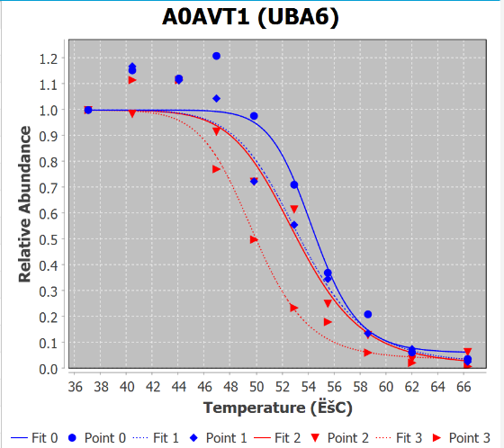

```
Hello! In this Vignette you will find how to convert FragPipe output to TPP-R (and if needed, TP-MAP) input.


## What is Thermal Protein Profiling (TPP)?
TPP is an unbiased method to search for drug targets by monitoring protein stability in the presence and absence of the drug compound of interest. Different samples at different temperatures are prepared and them label with [Tandem Mass Tags (TMT)](https://pubs.acs.org/doi/10.1021/ac0262560). Next, samples are pooled together and analyzed by typical mass spectrometry-based proteomics. In the links below users ar encouraged to review the Nature Protocol method and a recent overview of TPP to understand how the data is analyzed and how protein melting curves are obtained. 

  - 2015 [Nature Methods TPP protocol](https://www.nature.com/articles/nprot.2015.101)
  - Recent [small overview](https://pubmed.ncbi.nlm.nih.gov/36368297/)
  - Data use in this package was analyzed by FragPipe. Raw data was obtained from [a TPP study](https://www.nature.com/articles/s41467-019-09107-y), where the effects of ATP in protein solubility were determined.     
  
Comparing a protein melting curve with and without drug is important to determine if the compound had a destabilizing effect on the protein (melting temperature decrease) or the opposite stabilizing effect (melting temperature increase) or none.

## What is FragPipe?
- It is a set of computation tools capable of protein identification and quantification from bottom-up proteomics data. One of its modules is capable of analyzing TMT datasets, such as the one produced in TPP experiments. FragPipe is a very fast and robust pipeline, but there are no FragPipe-compatible TPP tools (until now). To learn how to use FragPipe see the link below:
  
  - [FragPipe website](https://fragpipe.nesvilab.org/docs/tutorial_fragpipe_outputs.html])
  
- For downstream TPP analysis of FragPipe data, this package makes it possible to use both TPP-R and TP-MAP.
  
## What is TPP-R?
It is an R package available through Bioconductor capable of analyzing both 1D (temperature change) and 2D (temperate and drug concentration changes) TPP datasets. It produces melting curves for each protein as well as metrics on the fittings of the curves. For more details see the link below:

  - [TPP-R at Bioconductor](https://bioconductor.org/packages/release/bioc/html/TPP.html)

## What is TP-MAP?
It is a GUI-based TPP analysis program also available for both 1DTPP and 2DTPP data. Melting curves (1DTPP) or matrices (2DTPP) can be visualized in TP-MAP. protein-protein interactions analysis using STRING are also possible. for more information visit:

  - [2022 bioRxiv](https://www.biorxiv.org/content/10.1101/2021.02.22.432361v2)
  

**FragPipe TPP Workflows:
In FragPipe find the indicated workflows for 1D and 2DTPP. Obtained the results  and proceed with using the FragPipeTPP package. 

### Package Installation

Use: install.packages("FragPipeTPP") if package has not been installed.

There are four functions to use

- **tmitotppr** (FragPipe to TPP-R)

- **tpprNormOneDTPP** (TPPR all melting curve normalization only - required to input 1DTPP data into TP-MAP)

- **tpprTotpmap** (from TPP-R normalized FragPipe data to TP-MAP input file)

- **TwoDconversion** (FragPipe to TPP-R/2DTPP data analysis)

Below we will go through two different workflows where the functions above will be used.

### From FragPipe to TP-MAP
1. Run the default "TMT10-TPP" workflow in FragPipe for 1DTPP analysis
2. Once the FragPipe run has completed and you are ready to use TPP-R, start an R session:
3. Create two variables: the path to your FragPipe output folder and a vector with the desired labels used in your experiment.

  library(FragPipeTPP)
  FPpath <- FragPipeoutputpath
  explabels <- c(Vehicle vs Treatment)


4. Convert FragPipe output (from TMT-I tmt-report/ratio_protein_None.tsv) to TPP-R input (1DTPP analysis only). The function tmtitotppr takes two variables: FragPipe output folder and experimental variables (the ones we created in the step 1).It will output the headers to be changed and the before and after header values. This function will only return the path to the configuration files created by the function (a file needed by TPP-R to connect input files TMT labels with temperatures.)

  configpath <- FragPipeTPP::tmtitotppr(FPpath, explabels)

  The results are now saved in the newly created folder 1DTPP-TPPR. If you explore inside the new folder, not only the configuration file will be present, but also .txt files compatible with TPP-R for each replicate and experiment. 

5. We will now perform a general normalization procedure for all melting curves (add link to function in TPP-R and link to original paper) This function takes the normalization function from TPP-R and outputs the data ready for conversion into TP-MAP input file. Notice the new .csv files inside the 1DTPP-TPPR folder?


  FragPipeTPP::tpprNormOneDTPP(configpath,FPpath)


6. Finally the .csv files created in the last steps will be merged into one .tpmap.txt file along with a description string for each protein. This description information is needed for protein-protein interactions analysis in TP-MAP. First create the database variable and then run tpprTotpmap. 


  hoomandb <- "Path to Human fasta file"
  FragPipeTPP::tpprTotpmap(configpath,hoomandb)

The tptmap.txt file (located in the 1DTPP-TTPR folder) can now be loaded in TP-MAP. Below is how the melting curve for protein A0AVT1 looks like:

{width=60%}


### From FragPipe to TPP-R: 1DTPP
Complete steps 1 - 4 from the **From FragPipe to TP-MAP** section. In step 5 instead of running tpprNormOneDTPP(configpath,FPpath), the full TPPR workflow function will be used. Remember to use the correct configuration file path and to pass the function a directory to save the results (in this case 1DTPP-TPPR folder):


TPPRfolder <- file.path(FPpath, "1DTPP-TPPR")

TPPTR_result <- TPP::analyzeTPPTR(configpath,resultPath = TPPRfolder , methods = "meltcurvefit",idVar= "Prot_ID",qualColName="qssm")

and voila! Melting curves have been fit for each protein (see Melting_curves folder, QCPlots.pdf and results_TPP-TR.xlsx). For more information on TPP-R outputs see [package website](https://bioconductor.org/packages/release/bioc/html/TPP.html).


### From FragPipe to TP-MAP: 2DTPP

1.Create two vectors. One for the FragPipe results path and another for the location of the reference database.
resultPath <- "c:/FragPipefolder" 
fastadatabsefile <- "c:/proteindatabase.fas

2. Use tmtTotpmap_2D
tmtiTotpmap_2D <- function(resultPath, fastadatabsefile)

A 2DTPP TP-MAP file will be saved in a "2DTPP" folder inside the resultPath.

### From FragPipe to TPP-R: 2DTPP

1. Create several variables:
  a). FragPipe results folder: twofragpipe <- "Z:/crojaram/TPP_Project/PXD012423/2DTPP/ATP_rep1/FP20-1_build23"
  b). Compound concentration values: conc_labels <- c(0,0.005,0.05,0.5,2)
  c). Temperatures pairs used in a plex: labels_exp <- c("42_44","46_48","50_52","54_56","58_60","62_64")
  d). The string for the compund: compound <-c("ATP")
  e). saveouput <- file.path(twofragpipe, "2DTPP-TPPR")

2. Run function with the variables crated, except variable e). 
  configtwo <- twoDConversion(twofragpipe,labels_exp,conc_labels,compound)
  
3. The output from step 2 will be used in TPPR using function analyze2DTPP. Use variable e) as the resultPath.

  
  tpp2dResults <- TPP::analyze2DTPP(configTable = configtwo,
                                  compFc = TRUE,
                                  idVar = "Prot_ID",
                                  intensityStr = "rel_fc_",
                                  nonZeroCols = "qusm",
                                  methods = "doseResponse",
                                  createReport = "none",
                                  resultPath = saveoutput)

4. Results from twoDConversion fucntion can be used with the [TPP2D package](https://www.bioconductor.org/packages/release/bioc/vignettes/TPP2D/inst/doc/TPP2D.html), also available in Bioconductor. Use the fucntion as depicted below, excpet for concFactor if the compound of interest is in another concentration range that is no 1e6 mM.
  
  import_df <- TPP2D::import2dDataset(
    configTable = configtwo,
    data = NULL,
    idVar = "Prot_ID",
    intensityStr = "sumionarea_",
    fcStr = NULL,
    nonZeroCols = "qusm",
    geneNameVar = NULL,
    addCol = NULL,
    qualColName = "qupm",
    naStrs = c("NA", "n/d", "NaN"),
    concFactor = 1e6,
    medianNormalizeFC = TRUE,
    filterContaminants = TRUE)


